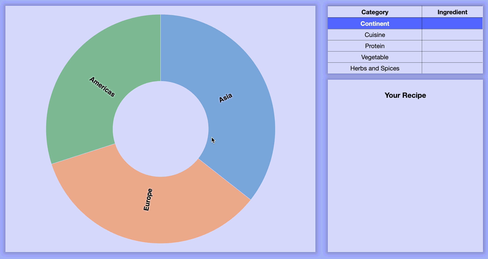

# Flavor Wheel

## Description

Flavor Wheel is a tool for planning delicious and cohesive meals by building dishes from their basic elements. Flavor Wheel visualizes flavors as a zoomable sunburst that displays two levels of hierarchy at a time. By successively clicking on elements in the innermost wheel, users can add elements that complement the items they have already selected. Flavor Wheel is meant to be a more dynamic version of its inspiration, Wendy McNaughton’s watercolor drawings in Samin Nosrat’s cookbook Salt, Fat, Acid, Heat (see example below).


## Technologies

* HTML & CSS
* Vanilla JS
* D3.js
* Webpack

## Features

* Users can click on sections of the wheel to add an element to their dish.
* Upon click, the wheel will zoom in to reveal another wheel of elements associated with the element already added.
* All of the user’s selected dish elements appear in the center of the wheel.
* Clicking the center of the wheel removes an element and shifts the wheel back one level of hierarchy.

### Sunburst

The core of this app is a "zoomable sunburst plot" built with D3.js. The sunburst translates a hierarchical JSON object into an SVG object that transforms upon user input. While the plot only shows one level of hierarchy at a time, clicking sections of the plot (i.e. "paths") will transition the current level out of the visible layer of the SVG and the next layer into the visible layer.


```js
index.js

  function handleClick(p) {
  
        ...

        // Set root data for the middle circle
        parent.datum(p.parent || root);


        // Sets the end position for the transition
        root.each(d => d.target = {
                x0: Math.max(0, Math.min(1, (d.x0 - p.x0) / (p.x1 - p.x0))) * 2 * Math.PI,
                x1: Math.max(0, Math.min(1, (d.x1 - p.x0) / (p.x1 - p.x0))) * 2 * Math.PI,
                y0: Math.max(0, d.y0 - p.depth),
                y1: Math.max(0, d.y1 - p.depth)
            });

        
        // Sets the length of the transition
        const t = g.transition().duration(500);

        // Executes the transition, interpolating between the closest hidden ring 
        // and changing the fill-opacity of that ring (to make it visible) and the 
        // current ring (to make it invisible)
        path.transition(t)
                .tween('data', d => {
                    const i = d3.interpolate(d.current, d.target);
                    return t => d.current = i(t);
                })
                .filter(function (d) {
                    return +this.getAttribute('fill-opacity') || arcVisible(d.target);
                })
                .attr('fill-opacity', d => arcVisible(d.target) ? (d.children ? .6 : .75) : 0)
                .attr('stroke', this.getAttribute('stroke') ? 'none' : null)
                .attrTween('d', d => () => arc(d.current))


        // Excecutes the same transition for the labels
        label.filter(function (d) {
            return +this.getAttribute('fill-opacity') || labelVisible(d.target);
        }).transition(t)
                .attr('fill-opacity', d => +labelVisible(d.target))
                .attrTween('transform', d => () => labelTransform(d.current));
    }

```

### SVG patterns

The sunburst uses pattern elements to mimic the CSS background-image property. Each background image is stored as a pattern object in the main HTML file and then dynamically rendered in the sunburst by matching the name of a path element's label to the ID of the pattern element.

```html
index.html

 <div class="app-body">
   <div class="graph">
     <svg>
        <defs>
              <pattern id="allspice" patternUnits="userSpaceOnUse" width="50%" height="50%">
                  <image xlink:href="./dist/photos/allspice.jpg" x="0" y="0" width="50%" height="50%" preserveAspectRatio="xMinYMin slice" />
              </pattern>
              <pattern id="basil" patternUnits="userSpaceOnUse" width="50%" height="50%">
                  <image xlink:href="./dist/photos/basil.jpg" x="0" y="0" width="50%" height="50%" preserveAspectRatio="xMinYMin slice" />
              </pattern>
            ...
        </defs>
     </svg>
   </div>
 </div>
```

```js
index.js

    const path = g.append('g')
        .selectAll('path')
        .data(root.descendants().slice(1))
        .join('path')
            .attr('fill', d => color((d.children ? d : d.parent).data.name))
            .attr('fill-opacity', d => arcVisible(d.current) ? (d.children ? 0.6 : 0.4) : 0)
            .attr('d', d => arc(d.current));

    path.filter(d => d.children)
        .style('cursor', 'pointer')
        .on('click', handleClick)
        .on('mouseover', mouseOver)
        .on('mouseout', mouseOut)

    path.filter(d => d.depth === 5)
        .attr('fill', d => `url(#${d.data.name.split(" ").join("-")})`)
```

### Table and Recipe

To keep track of the items select and to guide the user through the sunburst, two sidebar elements both constructed with D3.js, store and render data as the user clicks through the plot. First, a table identifies the level of hierarchy the user is currently at with highlighting and text bolding and stores the items selected upon click. Second, a narrative "recipe" guides the user through the sunburst and ties their selections together. 



```js
index.js

    function handleClick(p) {
        
        // Update recipe with new item or remove last item
        if (recipe[p.depth + 1]) {
            // Remove text from appropriate table row
            d3.select(`.ingredient-${p.depth + 1}-row`)
              .text('')

            // Switch highlight to appropriate row
            d3.select(`tbody > tr:nth-child(${p.depth + 2})`)
                .style('background-color', 'transparent')
                .style('font-weight', 'normal')
                .style('color', 'black')
            
            d3.select(`tbody > tr:nth-child(${p.depth + 1})`)
                .style('background-color', '#3e54ffde')
                .style('font-weight', 'bold')
                .style('color', 'white')


            // Delete item from recipe object
            delete recipe[p.depth + 1]

            // Remove section from instructions
            d3.select('.ingredients-list')
              .selectAll('p')
              .data(Object.values(recipe))
              .exit()
              .remove()

            // Remove herbs/spices from table if you were at the end of the table previously
            if (p.depth === 3) {
                d3.select('.ingredient-5-row')
                  .selectAll('a')
                  .remove()
            }

        } else if (p.depth !== 0) {

            // Add text to appropriate table row
            d3.select(`.ingredient-${p.depth}-row`)
                .datum(p.data)
                .append('a')
                .attr('href', d => handleLinkCreate(d))
                .attr('target', '_blank')
                .text(d => d.name)

            // Switch highlight to appropriate row
            d3.select(`tbody > tr:nth-child(${p.depth + 1})`)
                .style('background-color', '#3e54ffde')
                .style('font-weight', 'bold')
                .style('color', 'white')
            
            d3.select(`tbody > tr:nth-child(${p.depth})`)
                .style('background-color', 'transparent')
                .style('font-weight', 'normal')
                .style('color', 'black')


            // Add item to recipe object
            recipe[p.depth] = {[p.depth]: p.data.name}

            // Add section to instructions
            d3.select('.ingredients-list')
              .selectAll('p')
              .data(Object.values(recipe))
              .enter()
              .append('p')
              .text(d => handleRecipeCreate(d))

            // Add herbs/spices to table if you're at the innermost level
            if (p.depth === 4) {
                d3.select('.ingredient-5-row')
                    .selectAll('a')
                    .data(p.data.children)
                    .enter().append('a')
                    .text(d => d.name)
                    .attr('href', d => handleLinkCreate(d))
            }
        }
        
        ...
  }

```


